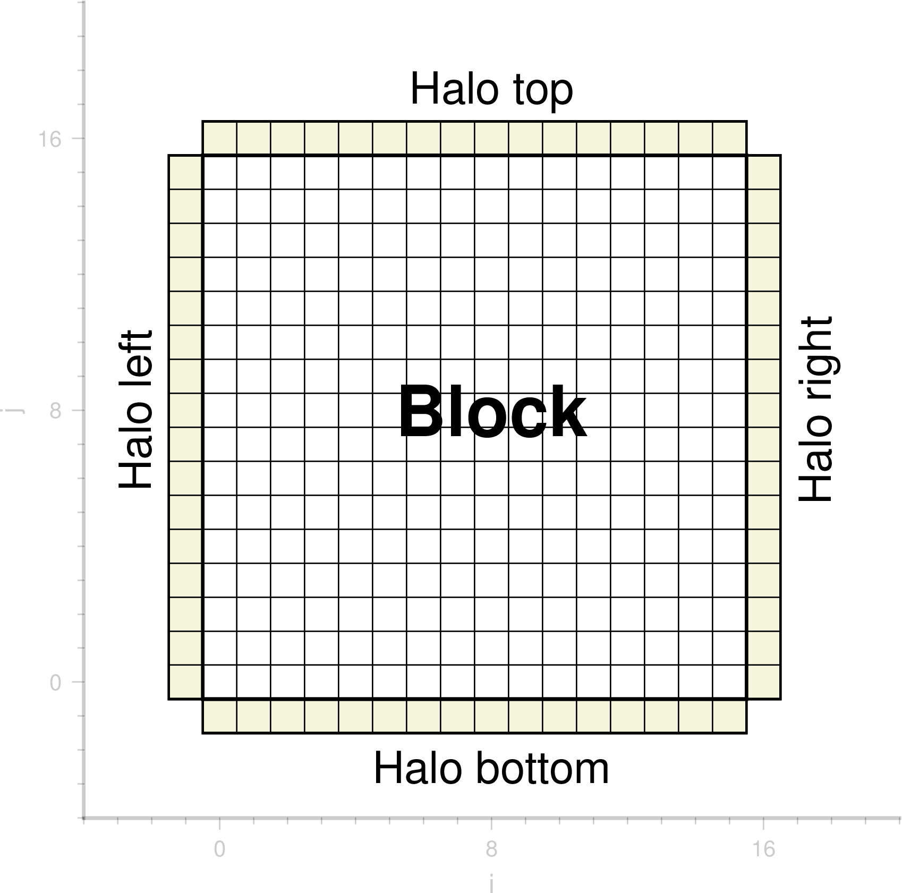
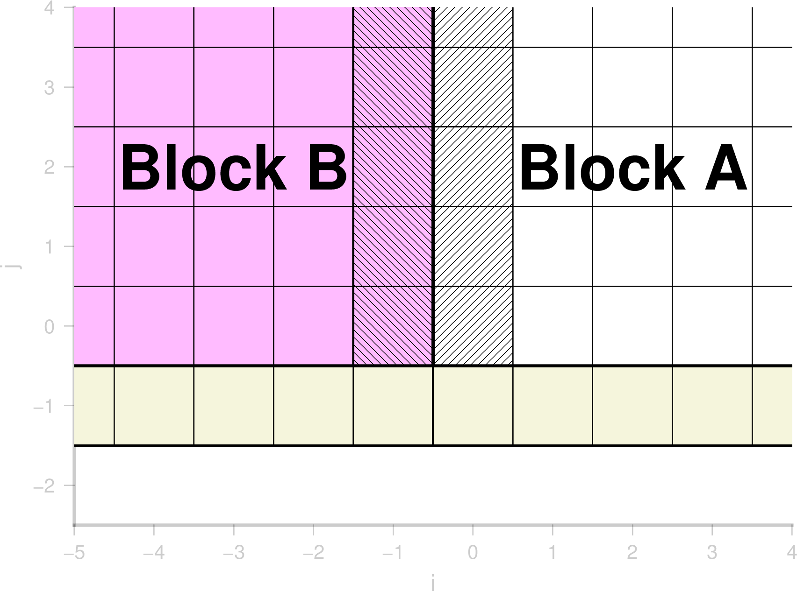
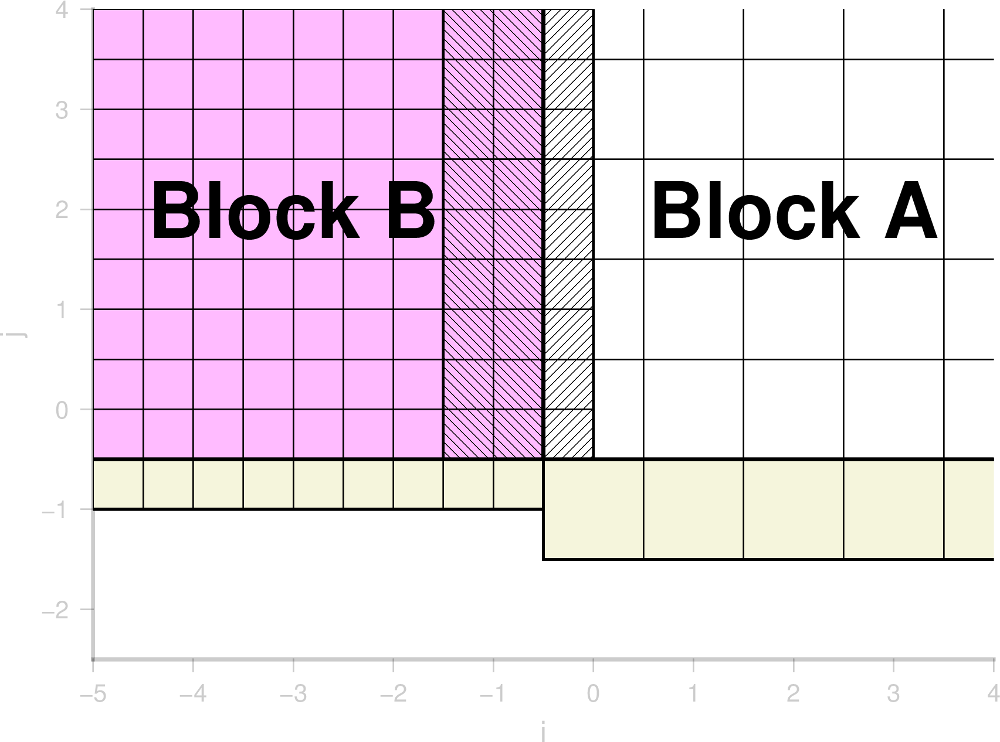

# Halo and gradient
Using multi-resolution in BG_Flood, we need to keep track of how blocks with different resolutions talk to each other. This page tries to explain how this is done.

## Why halo
In BUQ grid we keep track of a ring of cells (halo) on every edge of the block. These cells store the information corresponding to the neighbor cells on the neighbor block. If the neighbor block is at the same level of refinement, the values in the halo are a simple copy otherwise they are calculated using the operations described below. The point of the halo is that, when doing operations on a block, the model doesn't need to look at other blocks. It also makes it cleaner and avoid repeating the costly calculation needed when two blocks are at a different levels of refinment.

The halo cells exist for all variables including gradients so, even when looking at immediate neighbor cells we can make 2nd order calculations. 

Here is a diagram for a block of 16x16 cells:

## Restriction and prolongation
In Basilisk the operation to calculate a value from one level to another are called restriction and prolongation depending whether you calculate from coarse to fine or fine to coarse.

If the two blocks are the same level of refinement:

otherwise:

### Prolongation
Prolongation is the action of extending a value from a coarse cell to a finer cell. Often this is done by using the gradient value. 
e.g.:

$$HaloB = A + Gradient(A) * dx * 0.5$$

### Restriction
Restriction is where we calculate the value of a coarse cell from values of fine cells. This is usually done with cell average.
$$HaloA = 0.25*(B1+B2+B3+B4)$$

## Filling the Halo: The chicken and the egg.
When doing a prolongation operation one needs the gradient of the variable but to calculate gradient the halo needs to be filled. This is a chicken and egg situation.

The naive way of doing this is to first do restiction, calculate a gradient (everywhere), then doing the prolongation and then recalculating the gradient (everywhere) to fix the gradient in the cell neighboring prologation cells. This is inefficient!

Instead we first fill the halo for straight copy cells and restriction cells. Then calculate gradient (everywhere) and then do the prolongation where needed and then recalculating the gradient on cells near halo only.

## Conserving elevation
Using prolongation at the wet/dry interface can lead to inconsistencies between h and zs. To limit the inconsistency zs is calculated from h after a prolongation calculation (see refine_linear). While this conserves mass, it, however, leads to a violation of the lake-at-rest resulting in (small) spurious velocity at that interface. To remove the instability and preserve the elevation of the water (rather than its mass) we use a conserve elevation option (conserveelevation = true). This gets rid of the instability and preserves the elevation of the water level but then violates the mass conservation.

## Fluxes halo are a bit different
