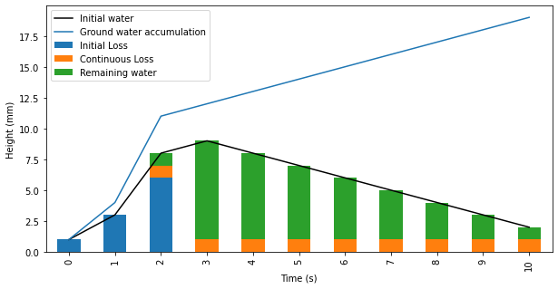

# Infiltration Model: Initial Loss - Continuous Loss

## Model implemented

The Initial Loss - Continuous Loss (ILCL) is a very basic model for infiltration of surface water in the soil.
It requires the input of two maps, based on the soil properties: one containing an initial loss coefficient $il$ in mm, the second containing a continuous loss coefficient $cl$ in mm/hr.

In this model, the initial and continuous losses are applied directly on the water elevation computed on each cell (and not by modifying the rain input).
The value of the initial loss $il$ is estimated to be the total of water infiltrating in the ground before the beginning of the surface runoff, whereas the continuous loss $cl$ is the loss that occurs, on wet cells, from the begining of the surface runoff to the end of the simulation.
The water absorbed in the ground will be tracked using the ground water elevation variable $hgw$ but wont be reintroduced to the surface flow through the computation process.

On each cell, at each simulation step, we can express the quantity of water absorbed in the ground $ha_{t}$ using:
$$
\begin{equation}
  ha_{t} =
    \begin{cases}
      h_{t} & \text{if\;\;} hgw_{t-1} + h_{t} < il\\
      cl & \text{if\;\;} hgw_{t-1} > il\\
      \min(il - hgw_{t-1} + cl\,,\, h_{t}) & \text{otherwise}
    \end{cases}       
\end{equation}
$$

where $il$ and $cl$ are respectively the initial loss and continuous loss coefficient at a given cell location, and $hgw_{t}$ is the accumulated ground water at this cell location since the begining of the simulation.

The water absorbed is then added to the ground water tracking variable:
$$hgw_{t}=hgw_{t-1} + ha_{t}$$
 and removed from the surface water height and the surface water elevation (not shown here):
 $$h_{t \;final} = h_{t} - ha_{t}$$

The following figure shows a representation of the initial loss - continuing loss model with $il = 10 mm$ and $cl = 1 mm/s$ :



*Initial loss and continuing loss reprensentation during a cell-wetting event*

### *_Important notes_*:
-> All cells that are initially wet at the begining of the simulation ($h > XParam.eps$) will have their initial loss (il) set to 0.0, in order to be consistent with the physic of the model.

```diff
-> This model is meant to be used with the rain on grid feature. The model is applied indistinctively to water from any source and can cause unexpected results if misused.
```

## Reference values
Some reference values for the $il$ and $cl$ coefficeint can be found in the literature. 
This is an example of compilation of some of these values from [https://help.innovyze.com/display/xprafts/Initial+and+Continuing+Loss+Model](https://help.innovyze.com/display/xprafts/Initial+and+Continuing+Loss+Model).


