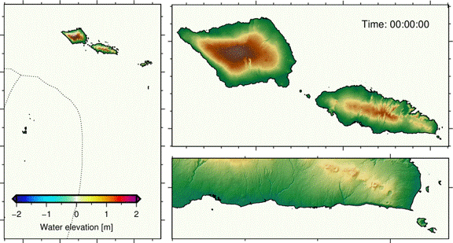
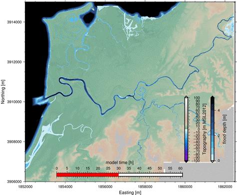

# Welcome to the BG_Flood documentation !
BG-Flood is a Shallow Water Equation (SWE) model based on the St Venant formulation of [Basilisk](http://basilisk.fr/) but applied to a Block Uniform Quadtree memory structure on the GPU (based on [Vacondio _et al._](https://dl.acm.org/citation.cfm?id=3031292)).

The model is designed to simulate [flood/inundation](https://english.stackexchange.com/questions/131195/difference-between-flooding-and-inundation) caused by tsunami, river, rain, tide or storm surge (from wind stress or atmospherique pressure differential) or any combination of these. The model does not (yet) include the effect of wind waves. The model is not restricted to simulating inundation hazard and can also be used for depth averaged circulation simulation. 

!!! info 
    This wiki is to help users getting started on using the model. 
    This is work in progress...
    If you have any issue/question post it on the issue board. While the model is fairly user friendly, it was designed for users with a basic understanding of hydrodynamics and some experience in modelling. The wiki (and the model) expect that users have some experience in basic file manipulations and are comfortable with handling NetCDF files for input and output.

This code is an open-source shallow water solver. Designed to be fast, it run on GPUs and generate its own adaptative mesh. It is mainly used in a context of flooding:

- fresh water flooding (fluvial and pluvial)
- tsunami propagation and run-off

# Model development stage
BG-Flood is still in early development stage but is already useful for real inundation simulation.       

The master branch is at stage 4 of development with 5 stage planned as below:

- [x] Cartesian naive formulation
- [x] Same but with some ease of use for modelling studie
- [x] Block Uniform formulation at constant level with masked blocks (with a full swing of _user friendly_ capabilities)
- [x] Static Block uniform Quad-tree formulation (i.e. adapted mesh at the first step only )
- [ ] Set of core solvers:
    * [x] Reimann
    * [x] Kurganov
    * [ ] new one...
- [ ] fully adaptive Block uniform Quad-tree formulation  (i.e. basilisk style wavelet refine)

<!--
-->

**Testing**
CI test (development branch): 

<!--

# How to install

## From precompiled binaries (Win10 only)
1. download the zip from any release
2. unzip into preferred path
3. Add path to "Path" in environment variables (search for "Edit environment variables for your account")
4. When updating/upgrading BG_Flood simply repeat 1 and 2

## On Linux machines
Use instead if needed:
* [Manual](Manual.md)
* [Modules](modules/Modules.md)
* [Tutorials](tutorial/Tutorial_intro.md)

*  Compile-under-linux
*  Use-On-SuperComputer

## How to use the model {#User}

*  Manual
*  Modules
*  Tutorials 
*  Test-and-Examples 

# How to use/change the code {#Developer}
*  Code-map
-->
