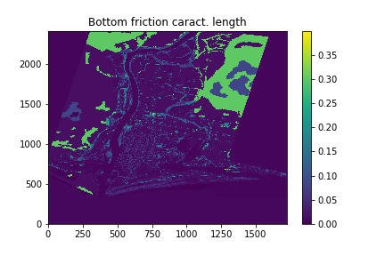

---
title: Mkdoc-material set-up!
---

# Page title

# Welcome to MkDocs by Alice
For full documentation visit [mkdocs.org](https://www.mkdocs.org).

## Commands
* `mkdocs new [dir-name]` - Create a new project.
* `mkdocs serve` - Start the live-reloading docs server.
* `mkdocs build` - Build the documentation site.
* `mkdocs -h` - Print help message and exit.

## Project layout

    mkdocs.yml    # The configuration file.
    docs/
        index.md  # The documentation homepage.
        ...       # Other markdown pages, images and other files.

## Test of mkdoc functionnalities
### Admonitions ([link](https://squidfunk.github.io/mkdocs-material/reference/admonitions/)):

!!! tip "Phasellus posuere in sem ut cursus"
    Lorem ipsum dolor sit amet, consectetur adipiscing elit. Nulla et euismod
    nulla. Curabitur feugiat, tortor non consequat finibus, justo purus auctor
    massa, nec semper lorem quam in massa.

### Latex:
Latex is working : $d_n$ or 
$$
d_n={$rac{10}{5}}
$$

### Pictures:
{ align=left }

<figure markdown="span">
  { width="300" }
  <figcaption>Image caption</figcaption>
</figure>

based on @10.1016/j.envsoft.2016.11.012

### References

$full_bibliography

### Adding nice videos
see Home!

