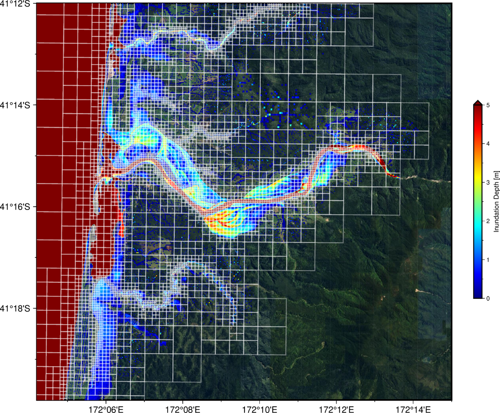

# Summary

`BG_Flood` is a numerical model for simulating shallow water hydrodynamics on GPUs using a variable-resolution grid. The model is designed to simulate inundation processes (including fluvial, pluvial/rainfall, storm-surge, and tsunami events) accurately and rapidly, while providing a high degree of automation to enable the simulation of numerous scenarios. The model interface consists of a simple text configuration file combined with NetCDF support for environmental forcing and multi-dimensional output.

The computational mesh is generated using a Block Uniform Quadtree (BUQ) approach that balances the ease of variable refinement inherent in a quadtree structure with the massive parallel processing efficiency provided by the block-uniform architecture on a GPU. The targeted level of refinement is supplied as a gridded input to the simulation, often generated by combining coarse-scale preliminary simulation results with critical geographic or structural features, such as levee locations.

The core Shallow Water Equation (SWE) solver engine and its adaptation logic are based on the St. Venant solver from `Basilisk` [@popinet2011quadtree], while the CUDA GPU memory model is built upon foundations established by @vacondio2017. `BG_Flood` is implemented in CUDA-C++ and requires compatible NVIDIA hardware to achieve maximum computational throughput.

# Statement of Need

Inundation hazard assessment and forecasting rely heavily on physics-based simulations to accurately identify hazard characteristics such as flood extent, depth, and velocity. To be effective, the underlying hydrodynamic model must resolve fine-scale landscape topography and complex flow phenomena (e.g., urban drainage networks and hydraulic jumps), while simultaneously encompassing large-scale domains where hazards originate, such as full river catchments or continental shelves. Furthermore, the inherent uncertainties in inundation drivers typically necessitate a large pool of scenarios for ensemble simulations, sensitivity testing, and multivariate hazard assessments. This demands simulation tools that are physically accurate, computationally efficient, and highly automatable.

Capturing this cascade of spatial and temporal scales typically requires unstructured or adaptive variable-resolution meshes. Unstructured mesh generation can frequently become a bottleneck, relying heavily on manual user intervention and lacking the flexibility to adapt dynamically as a simulation progresses. In contrast, variable-resolution grids can be generated with minimal manual overhead and can potentially adapt during runtime. While variable-resolution grids allow users to transition iteratively from coarse, rapid prototypes to high-fidelity models, this flexibility traditionally incurs substantial computational overhead. For large-scale assessments, total execution runtime remains the primary constraint on either the maximum achievable grid resolution or the spatial extent of the modelling domain.

# Statement of field
While some GPU-compatible variable-resolution mesh codes exist to address this performance gap, they often lack the accessible, streamlined interfaces required for rapid, automated model development. `BG_Flood` addresses this gap by providing a GPU-native hydrodynamic model with a highly clean and efficient interface. It automates mesh generation and provides a flexible framework that allows users to rapidly deploy both simplified configurations and highly complex inundation models. By bridging the gap between high-performance "research-grade" high-computing code and user-friendly open-source software, `BG_Flood` enables efficient, large-scale inundation modelling that is accessible to the broader flood hazard community.

The model has been validated against standard academic benchmarks [@bosserelle2021bgflood] and real-world extreme events, including the 2009 Samoa tsunami [@bosserelle2020effects] and the 2023 Ex-Tropical Cyclone Gabrielle [@pelmard2026regional]. Full details on usage and validation cases are available in the official online documentation.

# Software design and key Features

`BG_Flood` is a GPU-native hydrodynamic model engineered to facilitate high-performance environmental simulations. The model prioritises computational efficiency and ease of use, providing a modern framework for simulating complex flows across varying spatial scales. BG_Flood was designed for 

## Numerical Framework and Performance

- **Efficient Block Uniform Quadtree (BUQ):** Implements a memory model inspired by @vacondio2017 to maximise GPU warp efficiency and significantly reduce memory latency within a CUDA-native framework. This variable-resolution grid implementation minimises the computational overhead typically associated with quadtree structures on GPU architectures (Figure 1). While this required intensive internal development it allows the code to run efficiently with a relatively naive implementation.
- **Multiple Solvers:** Implements several well-tested, depth-averaged Shallow Water Equation (SWE) solvers and reconstruction schemes. The core numerical schemes have been ported and adapted from the `Basilisk` framework [@popinet2011quadtree].
- **Explicit Mesh-Agnostic Preprocessing:** The computational mesh is generated natively by the code. All gridded geospatial inputs are automatically interpolated or block-averaged to the computational mesh during initialization, simplifying the preprocessing of disparate datasets. The mesh generation is This was acheived with minimal dependencies. 

## Data Interoperability and Automation

- **Standardised I/O:** Supports NetCDF for high-dimensional inputs (2D/3D fields) and raw model outputs, ensuring seamless compatibility with standard GIS and climate data pipelines. Model grid output are via NetCDF file designed to preserve the variable resolution structure of the mesh while maintaining compatibility with GIS raster format.
- **Human-Readable Configuration:** Uses plain text-based parameter files to ensure complete transparency for users while enabling automated programmatic generation for large-scale ensemble simulations.
- **Delimited Text Formats:** Utilises standard delimited text file formats for 1D inputs and outputs, such as time-varying boundary conditions and observed gauge data.
- **Unbounded Calendar and Timestamp Support** Includes native standard calendar date support extending beyond the date ranges available in default system libraries.

## Comprehensive Physical Forcing

Developed by domain scientists to address a wide range of inundation hazard processes, the model features:
- **Geophysical Forcing:** Supports land and seafloor deformation for tsunami modelling, allowing for precomputed co-seismic displacement inputs and timing profiles provided by finite fault models.
- **Meteorological Forcing:** Handles uniform or spatially and temporally varying wind stress and atmospheric pressure fields for predicting storm-surges.
- **Hydrological Inputs:** Includes uniform or space-time varying rainfall-runoff (rain-on-grid) capabilities and a high-capacity river "injection" system capable of handling hundreds of concurrent discharge sources with negligible impact on computational overhead.
- **Surface Characteristics & Losses:** Supports spatially varying roughness coefficients (e.g., Manning's $n$), infiltration loss models, and basic hydraulic structures.
- **Projected or spherical domain** supports both projected or spherical domain/inputs (i.e. latitude/longitude).

All the features are available at runtime and are orchestrated by internal flags in the model parameter.

# Research impact and applications

The utility and scalability of `BG_Flood` have been demonstrated through several high-impact research initiatives, most notably in the development of nationally consistent flood hazard frameworks.

## National-Scale Hazard Assessments

`BG_Flood` served as the core hydrodynamic flood model for the "Mā te haumaru o te wai" (Flood Resilience Aotearoa) programme [@harang2026]. This programme produced the first publicly available, nationally consistent flood inundation hazard and risk assessment for Aotearoa New Zealand. The project deployed `BG_Flood` within a semi-automated workflow covering 256 flood plains, demonstrating the model's capacity for "headless" command-line operation and its ability to ingest large-scale inputs, including high-resolution LiDAR-derived Digital Elevation Models (DEMs), flow hydrographs for hundreds of rivers, and spatially and temporally varying rainfall from synthetic storms.

## Rapid Post-Event Response

Rapid post-event simulations provide critical operational intelligence for emergency response and damage assessment operations following extreme weather events. Following Ex-Tropical Cyclone Gabrielle in 2023, the model was used to generate highly detailed inundation maps for the Hawke’s Bay and Tairāwhiti regions. These simulations provided a methodologically consistent dataset (resolving features down to 4 m) to support recovery efforts and validate the impacts of extreme weather events on regional infrastructure [@pelmard2026regional]. `BG_Flood` is also used during near-real-time tsunami responses to complement warning decisions, providing rapid assessments of far-field tsunami hazard propagation.

## Data Generation for Machine Learning

`BG_Flood` is actively utilised to generate extensive training catalogues of synthetic storm scenarios. These high-fidelity hydrodynamic outputs were used to train Machine Learning (Random Forest) emulators, creating highly efficient surrogate models capable of predicting local flood depths in mere seconds. This highlights the model's value not just as a standalone simulation tool, but as a robust data factory for the next generation of real-time rapid flood forecasting frameworks [@pozo2026].

# Acknowledgements

This work was supported by the New Zealand Ministry of Business, Innovation, and Employment (MBIE) Endeavour Fund through the National Institute of Water and Atmospheric Research (NIWA) programme *Mā te haumaru ō nga puna wai ō Rākaihautū ka ora mo ake tonu: Increasing flood resilience across Aotearoa* (contract C01X2014). The development of `BG_Flood` has been supported since 2017 by the Earth Sciences New Zealand Flagship Program and the New Zealand National Institute of Water and Atmospheric Research (NIWA) Taihoro Nukurangi Strategic Science Investment Fund Project program.

# AI usage disclosure
AI tools have solely been used to refine the clarity and phrasing of this manuscript, improve the readability of the software documentation, and assist with source code commenting. AI tools were not used to generate the core numerical algorithms or physics-based logic of BG_Flood. Experimental features (not yet available in the main branch) have been developed using AI workflow to accelerate development but test, key verification and architecture are driven and verified by human developers. 

# References
