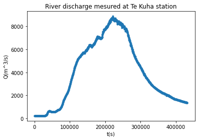
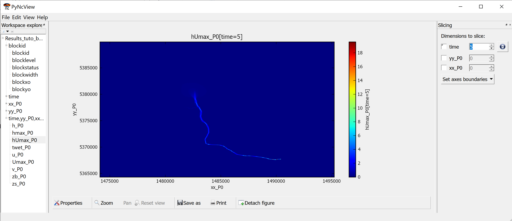
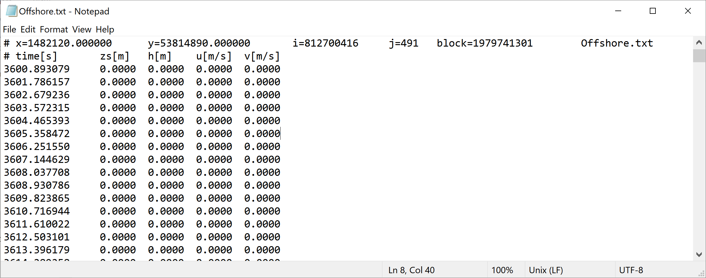
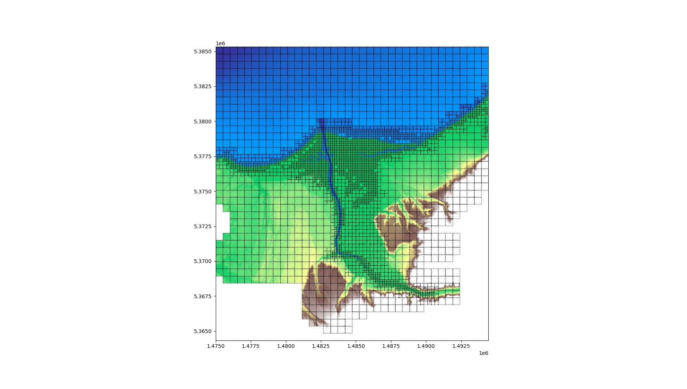

# River flooding tutorial

The objectif of this tutorial is to explain how to use the code BG_Flood to model river flooding.
As the code allows rain on grid, we will look at pluvial and fluvial flooding.

This testcase aims to broadly reproduce the flooding event that occured from the 16 to the 18 of July 2021 (a 1 in 50 year flood event). 
During this event, the Buller river, passing through the town of Westport, on the West Coast of the South Island of Aotearoa New Zealand, get out of its primary bed and flooded the Westport area.

!!! info "Prerequisite"
     Before begining this tutoral, the user is expected to have downloaded the windows executable ([last release](https://github.com/CyprienBosserelle/BG_Flood/releases/latest) on github) or compiled the sources (version > 0.8) of the BG_flood code on linux.

During this tutorial, we will build, step by step, a test case


# Param file
The interface with BG_flood software is done using only a text file:
```{bash} 
BG_param.txt
```
(This is the name of the input parameter file by defauls, an other name can be use as first variable when lauching BG_Flood.)

This file consists in a list of key words and inputs, separated by a "=" sign. 
For a full list of the available key words and a further description of this file, please refere to the [manual]{#Manual}.

# Preparation of the topography/bathymetry (DEM: Digital Elevation Model)
The DEM, topography or bathymetry file is the only necessary file to be added to BG_param file to run the model.
```{txt}
DEM = Wesport_DEM_8m.nc?z;
``` 


!!! note 
    Different formats can be used for this file ( ASCII: .asc or NetCDF .nc principally).
    As Netcdf files can contain different variables, the "?" follows by the name of the variable is needed.

Without further information, the code will run will default values for physical parameters and initialisation, Neumann boundaries and no external forcing:


A result files: `output.nc` is created (here opened with the [PyNcView]{https://pyncview.software.informer.com/}) 


It contains 2D spatial fields saved regularly in time.
It details the blocs information:

- blockid: block index
- blocklevel: level of refinement for each block
- blockstatus: Is the block active ?
- blockwidth: number of cells in x or y direction in the block (not considering halo cells for computational purpose only)
- blockxo/blockyo: coordinate of the bottom left corner of he block

the time 1D variables or coordinates:

- time: time vector in second or real time
- xx/yy axis: spacial coordinate in m (by default)

and the by default outputs:

- h : the water depth in m
- u : the veloctity vector component in the x direction
- v: the velocity vector component in the y direction
- zb: the bottom/ground elevation (m from vertical projection reference)
- zs: the surface water elevation (m from vertical projection reference)

(see manual for further description of the variables).

!!! note
    In BG_Flood, the memory is organised in blocked  


A log file: `BG_log.txt` (very similaire to the shell outputs) is also created to keep the terminal output information:


# Basic fluvial flooding set-up


## River discharge
The river are (at this stage) forced by a vertical discharge on a user defined rectagular area:
```{txt} 
river = river_discharge_TeKuha2.txt,1490249,1490427,5367640,5367805;
```
where the four final numbers are: $x_1$, $x_2$, $y_1$, $y_2$, to define the area for the vertical discharge and a text file containing the time-serie of the discharge (first column: time ($s$) from reference time, second column: river discharge in $m^3s^{-1}$).


This file has been generated from an observed hydrograph, with data saved every $5$min, in second from the begining of the simulation (or event):



For each new river, just add the a similar river input line in the parameter file.

## Timekeeping parameters
In this code, the time is defined in second, relative to some reference or the start of the simulation by default.

The end of the simulation is prescribed in second as :
```{txt} 
endtime = 21600;
```

The time steps can't be defined by the used, it will be automatically computed as the more restrictive one in the domain by the solver, using the prescribe CFL (Current Friedrich Limiter) value, $CFL=0.5000$ by default.

The simulation begin, by default at $t=0(s)$, but this can modify using "totaltime": 
```{txt} 
totaltime = 3600;
```
to begin one hour after the reference time (used in the forcings for example).

!!! note
    The code was initially designed to consider time only through duration in second. We can now use dates to defined time in the forcings and the param file, including a time reference. 

## Outputs
There is two types of outputs:

 - map outputs of 2D variables regularly through time
 - time-serie (TS) output of basic values, at a chosen point position, at each time step.

### Map outputs
By default, there is only a map output at the begining and end of the simulation.

The map output can be modify by:

- defining a timestep (in s) for these outputs:
```{txt} 
outputtimestep = 3600.0;
```
- changing the set of variables in the output file (from the list given in the manual)
```{txt} 
outvars = zs,h,u,v,zb,hmax,Umax,hUmax,twet;
```
The "max" variables will be the maximum value during the whole simulation. To reset it between the outputs, see the resetmax variable.
There is also special variables for risk assesment after inundation (Umax, hmax, hUmax, twet)
- changing the name of the output file:
```{txt} 
outfile = Results_tuto_basicRun.nc;
```
- saving the output as float (variables are saved as short integer by default.):
```{txt} 
smallnc = 0;
```

### Time-Serie outputs
For each TS output needed, a line with the destination file and the postition is needed:

```{txt} 
TSnodesout=Offshore.txt,1482120,53814890;
```
corresponding to `TSnodesout=filename.txt,x_p,y_p;`
The file contains 5 colums $(t, zs, h, u,v)$ with the value at the nearest grid point (to the position defined by the user).

## Resolution
For a first test, we will modify the resolution and set it to 40m to decrease the computational time:
```{txt} 
dx=40;
```

## Basic fluvial innundation results
This the shell output:

It shows that 1 river has been added to the model, and also the time progression with 5 map outputs (in addition to the initial time step).

In the outputs, we get the different fields requested, for 6 different times.


The Time-Serie output is:



# Completing the set-up
## Adding boundary conditions
Boundaries' conditions are refered by their position, using 'top/bottom/right/left' keywords. They are associated to a boundary type ( 0:wall; 1: Neumann (Default); 2:Dirichlet (zs); 3: abs1d) and possibly a file containing a time serie. In this case, the file name is placed before the type, coma-separated. 

In this case, we will use tide boundaries at when at least a part of the boundary is open on the sea, i.e. for the top, left and right boundaries.
At the bottom, we will conserve the default value: 1.
```{txt} 
left = tide_westport.txt,2; 
right = tide_westport.txt,2; 
top = tide_westport.txt,2; 
```

In this case, as the boundaries are relatively small compared to the time wave length, we will used the same value along all the boundaries. We will then have only two columns in the file: Time and one elevation.
tide_file
``` {txt "tide_westport.txt"}
0.000000 	0.714714 
600.000000 	0.794714 
1200.000000 	0.864714 
1800.000000 	0.934714 
2400.000000 	0.994714 
3000.000000 	1.054714 
3600.000000 	1.104714 
4200.000000 	1.144714 
4800.000000 	1.174714 
5400.000000 	1.194714 
6000.000000 	1.214714 
6600.000000 	1.214714 
7200.000000 	1.214714 
7800.000000 	1.204714 
8400.000000 	1.184714 
          ...
336600.000000 	-0.635286 
337200.000000 	-0.705286 
337800.000000 	-0.765286 
338400.000000 	-0.825286 
339000.000000 	-0.875286 
339600.000000 	-0.915286 
340200.000000 	-0.955286 

```

They correspond to a classic time Serie observed offshore of the river mouth.


(If more values, they will be regularly spread along the boundary and the forcing will be the linear interpolation of these values). 


## Bottom friction
Different models from bottom friction are available.
By default, the model used is -1 corresponding to a Manning model.
Here, we will use the model 1 corresponding to a roughness length (see manual for more information on the Bottom friction models).
The associated field (ASC or netCDF) or value must be enter with the key word
```{txt} 
frictionmodel=1;
cf=z0_100423_rec3.asc; #cf=0.01;  #If using a uniform value
```


!!! warning
    The model allows a roughness heigh or manning number map smaller than the computational domain and will extrapolate outside of the map.

## Initialisation
By default, the model is initialised by a plane water surface located at $z=0.0$.

This water level can be modify, depending of the local mean sea level and the vertical projection used to create the DEM, using:
```{txt} 
zsinit=-1.39; #in metre
```
The model can also be initialised using a restart/hot start.
A file containing a least the files zb, h or zs, u and v must be provided, with the steps (and no the time value) to use for the restart.
```{txt} 
hotstartfile = output_4.nc;
hotstep=5;
```

## Model controls
Some variables can be used to adjust the model (see Manual for more details):

- run on CPU (or choose a GPU to run on):
```{txt} 
gpudevice=0;
```
By default, the code will detect if there is a suitable GPU on the machine.
- Double precision instead of a float precision during the computation:
```{txt} 
doubleprecision = 1;
```
- Minmod limiter parameter (to tune momentum dissipation $\in [1,2]$)
```{txt} 
theta=1.3; #default value=1.3
```
- Minimum heigh to concidere a cell wet (m)
```{txt} 
eps = 0.00010000; #default=0.0001
```


# ... Adding the rain

The model allows rain on grid forcing to model pluvial inundations.

## Rain forcing
A rain intensity in $mm.h^{-1}$, time and space varying can be forced in the model.

The rain can be forced with a time serie (with uniform values on the domain) or a netCDF file if a spacial file is available:

- Time serie forcing:
```{txt} 
rainfall=rain_westport.txt
```
- Spacial file forcing:
```{txt} 
rainfile=VCSN_buller_202107_dailynzcsmcov_disaggdaily_500m_nztm_clipped.nc?depth;
```
Here, we will use a time serie:


If the data is given in "rain height", a post-processing to turn it in rain intensity will be needed (at least at this stage of development).

Using the rain on grid forcing will activate all the cells of the domain and will increase the computational time of the simulation. 
Part of the domain can be "de-activate" (the blocs memory will not be allocated for this area) using different methods:

- using the `x0` / `xmax` / `y0` / `ymax` keywords to restrain the extend of the computational domain (but still rectangular)
```{txt} 
x0=1475000; #m
```
- a manual mask with values 999 in the bathymetry will be read by the code as "non-active" area
- masking all the bloc with all cells having an elevation superior to some value:
```{txt} 
mask=250; #m
```
- using a shape file to define a "area of interest":
```{txt} 
AOI=Domain_buffered-sea2.gmt;
```
!!! note "Method advised"
     The last method, consisting in using a contour to identify the area we want to include, is advised as the method allows for example to select a catchment, or any complex contour shape. The expected shape is a *.gmt file that can be generated from a contour using [GMT](https://www.generic-mapping-tools.org/) tools or directly as a column of x,y points looped (first point = last point).


# Refining the grid in area of interest
The code is based on a Block-uniform quadtree mesh. Each block, actually a 16 by 16 cells, is one unit of computation in the GPU.
These blocks can have different resolutions (but resolution does not change during the computation at this stage).

The initial resolution of the grid is the resolution of the bathymetry/topographic data. To refine or coarsen the grid, you can weather use the "dx" key word and choose a new resolution for the whole domain; wether use the levels of resolution. The reference level, correponding to the bathymetry resolution will be the level 0. Levels of resolution are then defined in relation to the reference levels using positive integers to increase the resolution or refine and negative integer to coarsen the grid by a multiple of two. For a given level  $n$ , the resolution  $dx_n$ will be:
$$
dx_n=\frac{dx_0}{2^n}
$$
 
with  $dx_0$ the resolution at level 0. 

When refinning using the level implementation, different key words are expected:

- `Initlevel`: level used to create the first mesh created by the code in the mesh refinement process
- `Maxlevel`: maximim level of refinement (over-ruling other commands)
- `Minlevel`: minimum level of refinement (over-ruling other commands)

The grid can also be unregular with an adaptition of the grid to the model (variables at initialisation step or user-defined refinement map). In this case, the cells will be devided in 4 cells for refinement, or 4 cells merged in one for coarsening. The code will ensure a progressive change of resolution (no cell should have a neighbour with more than 1 level of resolution of difference.)

The different methods of refinement available in the code are called using the key word "Adaptation". The refinement can be based on a classical input variable or a variable calculated during the initialisation:

- `Threshold`: impose a threshold for a different level of resolution
- `Inrange`: impose a range for a different level of resolutuion or it can be defined using a map of target levels for refinement:
- `Targetlevel`: the levels of resolution will be targeted but will be overruled by the maxlevel, minlevel entrance.

To refine the grid for this case, we will use the *former coarse simulation* and create a map for values where hmax is strictly positive (and/or $umax$,$vmax$ different from zero), after removing the sea area. 

Here, the bathymetry map resolution is a 10m resolution ($dx=10m$). We will impose:

- a level -3 resolution ( $dx_{-3}=80m$) in the background domain, 
- a level 1 resolution ( $dx_1=5m$) in the flooded area
- a level 2 resolution ( $dx_2=2.5m$)  in the main river bed area. 

<figure markdown="span">
  { width="400" }
  <figcaption>Maximum water depth obtained using a coarse uniform mesh, used to inform refinement.</figcaption>
</figure>

<figure markdown="span">
  { width="400" }
  <figcaption>Refinement map obtained based on coarse model, used to enforce refinement.</figcaption>
</figure>

<figure markdown="span">
  { width="400" }
  <figcaption>Mesh refinement generated by the code.</figcaption>
</figure>


To use it, the following options need to be added to the param file:
```{txt} 
initlevel = -3 ;
maxlevel = 2 ;
minlevel = -3 ;
Adaptation = Targetlevel,refin_mask.nc?z ;
```


!!! note
     In order to optimise the results when using a refined grid, different bathymetry files can be provided. A higher resolution one with smaller extend can be provided as a second DEM and will be use by the code when refining the grid (the code will use the last entered, having the info available):
     ```{txt}
     DEM = Wesport_DEM_8m.nc?z;
     DEM = Wesport_DEM_2m_zoomed.nc?z;
     ``` 
	 Similarly, different input files can be used for the roughness coefficient.


!!! note "Note again ..."
     The code also allows for zone outputs: the output of different zones defined by the user (`output-file-name,x1,x2,y1,y2`):
     ```{txt}
     outzone=zoomed.nc,5.3,5.4,0.5,0.8;
     ``` 

## Results:
This is the logfile:
``` txt title="BG_log.txt"
#################################
BG_Flood v0.8
#################################
#################################
#
model started at 21-02-2023 21:22:53

Reading parameter file: BG_param.txt ...

Reading bathymetry grid data...
Reading forcing metadata. file: Westport_DEM_8m.nc extension: nc
Forcing grid info: nx=2604 ny=3137 dx=8.000000 grdalpha=0.000000 xo=1474101.125000 xmax=1494925.125000 yo=5364343.000000 ymax=5389431.000000

Reading boundary data...

Read Roughness map (cf) data...
Reading forcing metadata. file: z0_100423_rec3.asc extension: asc
For asc of bathy file please specify grdalpha in the BG_param.txt (default 0)
Forcing grid info: nx=1724 ny=2420 dx=4.800000 grdalpha=0.000000 xo=1480847.600000 xmax=1489118.000000 yo=5369291.600000 ymax=5380902.800000

Read Target level data...
Reading forcing metadata. file: refin_mask.nc extension: nc
Forcing grid info: nx=624 ny=400 dx=50.000000 grdalpha=0.000000 xo=1469074.407363 xmax=1500224.407363 yo=5364597.770576 ymax=5384547.770576

Preparing rivers (1 rivers)

Preparing Rain forcing

Adjusted model domain (xo/xmax/yo/ymax): 
	1474097.125000/1495057.125000/5364339.000000/5389459.000000
	 Initial resolution (level 2) = 10.000000
There are 1 GPU devices on this machine
Using Device: NVIDIA T500

Initializing mesh
	Initial number of blocks: 20567; Will be allocating 21596 in memory.

Initial condition:
	Warm start
	Initializing rivers
Adapting mesh
	 Iteration 1
		There are 20567 active blocks (21596 blocks allocated in memory), 0 blocks to be refined, 4723 blocks to be coarsen (with neighbour); 1675 blocks untouched; 14169 blocks to be freed (1029 are already available) 0 new blocks will be created
	 Iteration 2
		There are 6398 active blocks (21596 blocks allocated in memory), 0 blocks to be refined, 1023 blocks to be coarsen (with neighbour); 2306 blocks untouched; 3069 blocks to be freed (15198 are already available) 0 new blocks will be created
	 Iteration 3
		There are 3329 active blocks (21596 blocks allocated in memory), 0 blocks to be refined, 179 blocks to be coarsen (with neighbour); 2613 blocks untouched; 537 blocks to be freed (18267 are already available) 0 new blocks will be created
	 Iteration 4
		There are 2792 active blocks (21596 blocks allocated in memory), 0 blocks to be refined, 18 blocks to be coarsen (with neighbour); 2720 blocks untouched; 54 blocks to be freed (18804 are already available) 0 new blocks will be created
	 Iteration 5
		There are 2738 active blocks (21596 blocks allocated in memory), 0 blocks to be refined, 1 blocks to be coarsen (with neighbour); 2734 blocks untouched; 3 blocks to be freed (18858 are already available) 0 new blocks will be created
	 Iteration 6
		There are 2735 active blocks (21596 blocks allocated in memory), 0 blocks to be refined, 0 blocks to be coarsen (with neighbour); 2735 blocks untouched; 0 blocks to be freed (18861 are already available) 0 new blocks will be created

Initial condition:
	Warm start
	Initializing rivers
Setting up GPU

Model setup complete
#################################
Initialising model main loop
Create netCDF output file...
Warning! Output file name already exist   
New file name: Results_tuto_basicRun_2.nc
		Completed
Model Running...
Output to map. Totaltime = 7200.000000 s; Mean dt = 2.230207e-01 s

```
In the model output, each resolution is store independently. 
When open with pyncview, we can visualise each layer. QGIS can merge all these layer togather or a postratement steps will be needed.


## Ground infiltration losses (Basic ILCL model)
An Initial Loss, Continuous Loss model has been implemented in the code (see ILCL page). 


To use it, provide maps for the two coefficient as follow:
 ```{txt}
initialloss=InitialLoss.asc;
continuousloss=ContinuousLoss.asc;
 ``` 


#