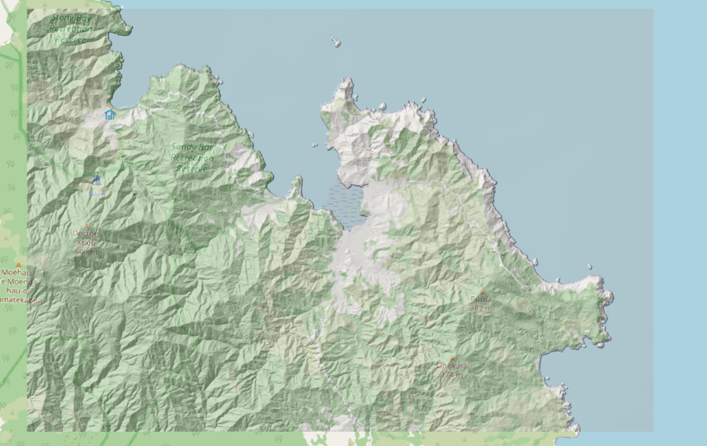

# Basic rain flood tutorial

The objective of this tutorial is to explain the basic use of BG_Flood and starting a simple model from scratch.

## START SIMPLE !
It is easy to get excited about starting a new model and adding lots of complex features (spatially variable rainfall, a friction map, a tide boundary, and a bunch of streams and culverts). But it is important to start simple. It is a lot harder to find what is going wrong with a complex model.

## Tools
BG_Flood is not a one-stop shop for making inundation models, and you will need to have a decent background on GIS data manipulation to develop complex models. A bit of knowledge on scripting languages does help too. In this tutorial we use only BG_Flood, but in my everyday model development I use:

* Scripting tools/notebooks make everything easier and easier to repeat operations. I use Julia, but many of my colleagues use Python.
* QGIS for quick visualisation of input and outputs.
* GMT for manipulating grids.

Don't have or like these tools? There are plenty of alternative ways to do these operations. Ask your favourite AI agent or search engine for help. 

## DEM 
A good inundation model requires a good topography and bathymetry. This requires a tutorial of its own. To keep this tutorial simple, we provided a ready-to-use DEM of Port Charles in Coromandel, Aotearoa New Zealand.




## Make it rain!
This tutorial is about rain on grid, so we need to put rain. Again keeping it simple, we just generate a text file with a timeseries of rainfall intensities (in mm/h). 

### Go big or go home
When developing a new model, it is useful to push the model to some extreme. This usually helps find problematic areas where the conditioning may not be optimal. So here I'm putting 100 mm/h of rain for an hour. In tropical areas, that would be about your 1% AEP 1-hour duration event. In NZ, this is a bit more extreme.

Here is my file: `rain.txt`

```
# time  rain_int
0.0   100.0
3600.0  100.0
3601.0  0.0
36000.0 0.0
```

> **Note:** BG_Flood reads time either as calendar datetime or seconds from an arbitrary date. Importantly, time steps do not need to be uniform; BG_Flood will linearly interpolate between them. So here, I want rain to go for one hour and then stop.

> **Important:** You need 0.0 rainfall after the rain stops to be in the rain file because the model will refuse to go beyond the last time in forcing! So here, I will not be able to (and shouldn't) run the model beyond 10 hours. 


## Make a parameter file
Yes, rainfall and a DEM are all you need to get a simple model started. Again, don't expect much from such a simple model, but it is a basic building block for a more complex and realistic model.

### General good practice for your parameter files

Add comments about what the model is meant to do and why. This makes it easier to modify when you revisit a model. I like to put a header on my files, but sometimes get a bit lazy.

BG_Flood will ignore any line starting with `#`.

```
################
## My BG_Flood simple rain model
#################

# Port Charles stress test 
```

### Tell the model about the DEM

BG_Flood parameters are always on the left of an `=` sign and the value of the parameters on the right. Beware that some parameters expect several values (normally separated with a comma).

For NetCDF input like a DEM, you need to specify the name of the variable in the NetCDF file (often `z` or `band1`). This is done by appending a `?` to the file name followed by the variable name.

```
##########
# DEM
##########

dem = PortCharles_DEM.nc?z
```

CF-compliant NetCDF files are self-describing, so BG_Flood takes care of the rest.

> **Tip:** BG_Flood can accept multiple DEMs to be superposed on top of each other. One classic example is a mildly coarse model with bathymetry superposed with a high-resolution DEM of just the land. 

### Defining the model domain
By default, BG_Flood will use the extent and resolution of the first `dem` parameter given by the user and will build a uniform grid with these parameters. 

> **Larger domain:** If you leave this default behaviour, you may notice the actual domain is slightly extended to the right and top of your DEM domain. This is because BG_Flood builds quadtree blocks that are 16x16 cells, and if the domain cuts across one block, it is automatically extended to fit the block. BG_Flood then repeats the values from the innermost cell to extrapolate.

Because this is a simple test, I do not want to run at full DEM resolution (4 m), and you shouldn't start any model at high resolution. BG_Flood makes it easy to build a coarse model, and then, once you are confident this is right, switch to fine resolution. The easiest way to do this is to force the base resolution of the model via:

```
##########
# Domain
##########

dx = 32.0
```

Now this is a bit coarser than my input resolution. BG_Flood will automatically average 4x4 cells to make the 32m cells.

### Specify your rain file

```
##########
# Forcing
##########

rain = rain.txt
```

### Optional but useful

While we could stop there, it is not very useful to let BG_Flood's default behaviour run the show. In particular, we want to specify what to output, how often, and where.

```
##########
# output
##########

outputtimestep = 600.00
outvars = hmax, zsmax, hUmax, h, zs, u, v, Umax
outfile = StressTest_Port_Charles.nc
```

> **Tip:** BG_Flood will **never** overwrite an existing file. Instead, it will add an incremental number to the end of the filename each time it runs (e.g., `StressTest_Port_Charles_1.nc`).


## Full BG_param.txt

```
################
## My BG_Flood simple rain model
#################

# Port Charles stress test 

##########
# DEM
##########

dem = PortCharles_DEM.nc?z

##########
# Domain
##########

dx = 32.0

##########
# Forcing
##########

rain = rain.txt

##########
# output
##########

outputtimestep = 600.00
outvars = hmax, zsmax, hUmax, h, zs, u, v, Umax

outfile = StressTest_Port_Charles.nc
```

## Run the model